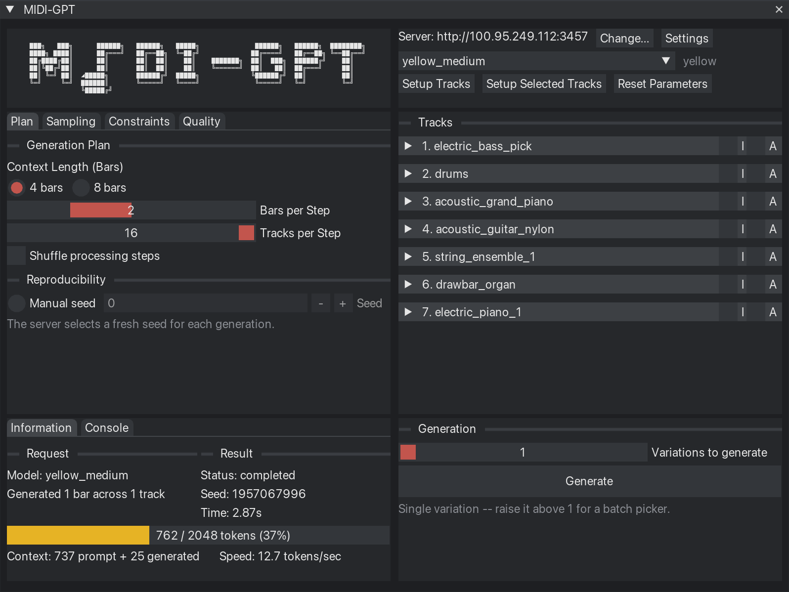

[](https://metacreation.net/category/projects/)

# MIDI-GPT for REAPER

[](LICENSE)
[](https://www.reaper.fm/)
[](https://www.python.org/downloads/)
[](https://github.com/Metacreation-Lab/MIDI-GPT)
[](https://arxiv.org/abs/2501.17011)
[](https://huggingface.co/Metacreation/MIDI-GPT)

<p align="center">
  
</p>

## Abstract

**MIDI-GPT for REAPER** brings [MIDI-GPT](https://github.com/Metacreation-Lab/MIDI-GPT) — a transformer model for multi-track, controllable MIDI generation — directly into [REAPER](https://www.reaper.fm/). Select a region in an existing project, choose which tracks and bars you want the model to touch, and generate: the plugin extracts your session's existing MIDI as context, sends a generation request to a MIDI-GPT inference server (local or remote), and writes the result straight back into REAPER. One dashboard window covers the whole workflow — server/model selection, per-track and global generation controls, and automatic instrument setup — so there's no manual synth routing or file exporting involved.

- **Fill in missing bars** — select a region and the model generates notes that fit your existing arrangement
- **Generate new tracks** — create empty bars, name (or auto-detect) the track's instrument, and let the model compose from scratch
- **Steer the output** — per-track density, polyphony, note duration, pitch masking, and remix controls, plus global sampling/validation settings
- **Iterative refinement** — regenerate any bar, track, or region, and pick between multiple generated variations
- **Context-aware** — the model reads the surrounding MIDI in every request and produces results that fit the key, groove, and texture already there

**Related docs:** [INSTRUMENTS.md](INSTRUMENTS.md) — instrument name/keyword reference · [VST.md](VST.md) — how automatic instrument setup works · [TUTORIALS.md](TUTORIALS.md) — video tutorials

---

## Table of Contents

- [Installation](#installation)
  - [Requirements](#requirements)
  - [One-Line Install](#one-line-install)
  - [Quick Install (Release Package)](#quick-install-release-package)
  - [REAPER Setup](#reaper-setup)
  - [Installer Flags](#installer-flags)
  - [Updating / Uninstalling](#updating-uninstalling)
- [Features](#features)
  - [The Dashboard](#the-dashboard)
  - [Global Options](#global-options)
  - [Per-Track Controls](#per-track-controls)
  - [Automatic Instrument Detection & Soundfont Setup](#automatic-instrument-detection-soundfont-setup)
  - [Hint Mode, Themes, Settings](#hint-mode-themes-settings)
- [Usage](#usage)
  - [Quick Start](#quick-start)
  - [Selecting Context & Target Bars](#selecting-context-target-bars)
  - [Remote Server Setup](#remote-server-setup)
  - [Tips & Common Gotchas](#tips-common-gotchas)
- [Contribution](#contribution)
  - [Running Tests](#running-tests)
  - [Building a Release](#building-a-release)
  - [Project Layout](#project-layout)
  - [Opening Issues / PRs](#opening-issues-prs)
  - [Future Work](#future-work)
- [Acknowledgments](#acknowledgments)
- [License](#license)

---

## Installation

### Requirements

- **REAPER** 64-bit (v6 or later) — [Download REAPER](https://www.reaper.fm/download.php) (select the **64-bit** version for your OS)
- **ReaImGui** — the REAPER extension the dashboard UI is built with. The installer downloads and installs this for you automatically (direct download with checksum verification — no ReaPack browsing or REAPER restart needed for the normal path)
- **Python** 3.10 – 3.12 (3.12 recommended) — [Download Python](https://www.python.org/downloads/)
- **git** — used as a fallback source clone if installing the MIDI-GPT backend from PyPI fails
- **curl** — used to download ReaImGui, ReaPack, and the Arachno soundfont
- **Microsoft Visual C++ Redistributable** (Windows only, 14.40 or newer) — required by PyTorch. The installer checks for it and offers to install it from Microsoft for you (Windows will ask for administrator permission once). To install it yourself: [vc_redist.x64.exe](https://aka.ms/vc14/vc_redist.x64.exe)
- **OS:** macOS, Linux, or Windows 10/11 (64-bit)

### One-Line Install

**macOS / Linux:**
```bash
curl -fsSL https://raw.githubusercontent.com/Metacreation-Lab/midigpt-REAPER/main/bootstrap.sh | bash
```

**Windows (PowerShell):**
```powershell
irm https://raw.githubusercontent.com/Metacreation-Lab/midigpt-REAPER/main/bootstrap.ps1 | iex
```

Clones the repo to `~/midigpt-REAPER` (macOS/Linux) or `%USERPROFILE%\midigpt-REAPER` (Windows) and runs the full installer. Requires Python 3.10–3.12 and `git`; if Python is missing, the script tells you exactly how to get it for your OS. To point the install at a local MIDI-GPT (the model) source checkout instead of installing it from PyPI, set `MIDIGPT_DIR=/path/to/MIDI-GPT` (or `$env:MIDIGPT_DIR` on Windows) before running the command above.

**To update later:**
- macOS/Linux: `cd ~/midigpt-REAPER && ./update.sh`
- Windows: `cd ~\midigpt-REAPER; .\update.ps1`

**To uninstall:**
- macOS/Linux: `cd ~/midigpt-REAPER && ./uninstall.sh`
- Windows: `cd ~\midigpt-REAPER; .\uninstall.ps1`

### Quick Install (Release Package)

Download the latest release zip from [Releases](https://github.com/Metacreation-Lab/midigpt-REAPER/releases/latest), extract it, and double-click the installer for your OS:

| OS | Double-click |
|----|--------------|
| macOS | `Install - Mac.command` |
| Linux | `Install - Linux.sh` |
| Windows | `Install - Windows.bat` |

### REAPER Setup

After installing, load the dashboard into REAPER once:

1. In REAPER: **Actions > Show Action List > Load ReaScript...**
2. Navigate to your REAPER resource folder's `Scripts/MIDI-GPT/` directory:
   - macOS: `~/Library/Application Support/REAPER/Scripts/MIDI-GPT/`
   - Windows: `%APPDATA%\REAPER\Scripts\MIDI-GPT\`
   - Linux: `~/.config/REAPER/Scripts/MIDI-GPT/`
3. Select `MIDI-GPT.py` and click Open.
4. Run **MIDI-GPT.py** from the Action List to open the dashboard. Worth binding it to a toolbar button or keyboard shortcut, since it's the only action you'll use day to day — everything else lives inside the window it opens.

(The folder also contains 4 other scripts the dashboard's buttons call under the hood — they're not meant to be loaded directly, so there's no need to touch them.)

### Installer Flags

| macOS / Linux | Windows | What it does |
|---|---|---|
| `--skip-deps` | `-SkipDeps` | Skip the system dependency check |
| `--skip-reaper-config` | `-SkipReaperConfig` | Skip automatic REAPER Python/ReaScript configuration |
| `--reaper-only` | `-ReaperOnly` | Only do REAPER integration (symlinks/junction, ReaPack, ReaImGui, `reaper.ini`) — skips the venv/backend entirely |
| `--backend-only` | `-BackendOnly` | Only do the venv/backend — skips REAPER integration entirely, so REAPER never needs to be closed. What `update.sh`/`update.ps1` use under the hood |
| `--torch-gpu` | `-TorchGpu` | Install PyTorch with GPU support (CUDA on Linux/Windows; macOS MPS is already in the default wheel) |
| `--midigpt-src=PATH` | `-MidigptSrc PATH` | Path to a local MIDI-GPT source checkout (sibling folder by default) |

### Updating / Uninstalling

- **Update:** `./update.sh` / `.\update.ps1` (accepts any installer flag, e.g. `./update.sh --torch-gpu`)
- **Uninstall:** `./uninstall.sh` / `.\uninstall.ps1` — removes the Python virtual environment, the REAPER Scripts integration, and the downloaded Arachno soundfont. Leaves ReaPack, ReaImGui, Sforzando, and REAPER's ReaScript/Python settings in place (you may be using them for something else; on Linux it prints the `apt remove` command for Sforzando), and asks first about deleting cached model checkpoints (from `huggingface_hub`'s shared cache) and the plugin folder itself.

---

## Features

### The Dashboard

Run `MIDI-GPT.py` for one window covering the whole workflow: server/model selection, track setup, global generation settings, per-track controls, running a generation, and a console/information log. Its top row shows the current server address (**Change...** to edit it), a model picker (populated once the server reports its available models) with the detected architecture next to it, **Setup Tracks** / **Setup Selected Tracks** (auto-assign instruments — see below), **Reset Parameters** (resets every global setting and per-track control back to default), and **Settings** (hint mode, theme, and a link back to this repo).

### Global Options

Four tabs:

- **Plan** — Context Length in bars (locked to whatever values the loaded model checkpoint can actually see at once), Bars per Step, Tracks per Step, a shuffle-processing-order toggle, and seed control (manual seed toggle + value; a fresh seed is used automatically otherwise).
- **Sampling** — Temperature, plus optional Top-p and Top-k (each behind its own enable checkbox).
- **Constraints** — optional polyphony limit (max voices) and note density limit (max notes), each off by default. These are **hard** limits enforced on generation globally, distinct from the per-track density/polyphony controls under [Per-Track Controls](#per-track-controls), which steer rather than hard-cap.
- **Quality** — validation mode (Off / Novelty / Silence / Novelty + Silence), max retry attempts, and an optional temperature increase on retry.

### Per-Track Controls

Every track gets an **I** (Ignore — exclude this track entirely) and an **A** (Autoregressive — regenerate the whole context window on this track, not just the bars you selected) checkbox, plus three tabs:

- **Core** — note density, polyphony (voice count), and note duration limits. Which of these actually apply is model- and role-aware: on the default Yellow model, drum tracks only get a density limit and melodic tracks only get polyphony/duration limits (matching what the model itself uses), with whichever controls don't apply called out explicitly rather than left silently inert.
- **Pitch** — pitch masking (by scale + root, or explicit allowed pitch classes) and register shaping (uniform range or a normal distribution around a mean pitch).
- **Remix** — regenerate a track's existing bars as a variation of what's already there (pitch-only or pitch + duration, adjustable amount) instead of generating fresh content.

### Automatic Instrument Detection & Soundfont Setup

**Setup Tracks** / **Setup Selected Tracks** detects each track's GM instrument straight from its MIDI content (channel 10 → drums, otherwise its first Program Change event) and adds a ready-to-play Sforzando + Arachno instance for it — no manual synth routing, no template tracks. Tracks it can't resolve automatically can be confirmed or overridden individually. See [INSTRUMENTS.md](INSTRUMENTS.md) for the full instrument name/keyword reference, and [VST.md](VST.md) for how the automatic setup works under the hood. To redo a track's instrument, select the track, click **Setup Selected Tracks** and choose **Replace it**.

This automatic setup only recognizes Sforzando's **VST or VST3** build in REAPER's plugin list — when installing Sforzando, make sure REAPER has scanned one of those. **AU and CLAP are not supported** (its installer also offers them, but Setup Tracks has no FX chunk format for either). If Setup Tracks reports Sforzando isn't in REAPER's plugin list, check **Options > Preferences > Plug-ins > VST** and rescan.

**Linux:** Sforzando for Linux is a **beta** from Plogue. It works with MIDI-GPT (its VST3 was tested end to end on Ubuntu 24.04 with REAPER 7.80: Setup Tracks, SoundFont conversion, generation), but it may be less stable than the macOS/Windows builds and may change without notice. Get it from Plogue's [downloads page](https://www.plogue.com/downloads.html#sforzando) ("sforzando for Linux (beta)"): unzip it, open a terminal in that folder and run `./install_sforzando.sh` — Plogue's own installer, which asks for your password itself (don't prefix `sudo`). It installs to `/opt/Plogue` (a fixed path) and puts the plugins in `/usr/lib/vst3` and `/usr/lib/clap`. REAPER on Linux doesn't scan `/usr/lib/vst3` by default, so `install.sh` adds it to REAPER's VST paths; restart REAPER after installing Sforzando. On a minimal install without a desktop environment, Sforzando also needs `sudo apt install libxcb-util1`.

### Hint Mode, Themes, Settings

Open **Settings** from the dashboard's top row to toggle hover hints (off by default — turns on a one-line explanation for whatever control you're hovering) and pick a theme: Dark (default), Light, Midnight, Solarized, Forest, Ocean, or Metacreation.

---

## Usage

### Quick Start

1. Import or record MIDI in your REAPER project.
2. Run `MIDI-GPT.py` to open the dashboard.
3. Click **Setup Tracks** to auto-assign instruments (or handle it per-track later with **Setup Selected Tracks**).
4. In REAPER, set a time selection over the bars you want the model to use as context, and select the MIDI item(s) on the track(s) you want it to actually generate/replace.
5. Adjust Global Options and any per-track controls you need.
6. Click **Generate**. Progress and token usage show in the dashboard's Information tab; results write back into REAPER automatically, or land in a candidate picker if you asked for more than one variation.

### Selecting Context & Target Bars

The model works in whole bars, on REAPER's own bar grid. Set a time selection (or loop) over the bars you want as context, and select the MIDI item(s) on the track(s) whose overlapping bars should actually be generated — bars that are in range but not selected are sent as context only, not as generation targets.

If your selection doesn't land exactly on a bar line — for example your song's real downbeat is offset from REAPER's own bar 1 — extraction still rounds outward to whole bars on each side, but the dashboard now warns you how much extra got included rather than silently sending more than you selected. If you see that warning, either re-snap your loop points to the grid, or fix the underlying offset via REAPER's own project measure/beat-offset setting.

### Remote Server Setup

By default the dashboard talks to a server on `http://127.0.0.1:3456`. If your MIDI-GPT server runs elsewhere (a remote workstation, another machine on your LAN), click **Change...** next to the server address in the dashboard's top row and enter its address, e.g. `192.168.1.20:3456` (`http://` is assumed if you leave it off).

### Tips & Common Gotchas

- **Loop size and Context Length**: for the shortest generation time, keep your time selection close to the dashboard's Context Length setting (Global Options → Plan) — a much larger selection forces the model to process more context than it needs to.
- **Generating more bars than Context Length**: you can target more bars than the Context Length in one request — generation uses a sliding window, producing Bars per Step bars at a time and stepping forward through the full target range, rather than needing everything to fit in a single context window at once.
- **Per-track controls on an empty track (non-Autoregressive/infill mode)**: with Autoregressive off, control values for a track's unset bars get inferred from that track's own existing content. On an empty track that context is itself empty, which biases the inferred controls toward silence — set density/polyphony/duration explicitly before generating into an empty track rather than leaving them to be inferred. This doesn't apply with Autoregressive on: there, the model resamples its own control values instead of inferring them from existing content, so leaving them unset just lets it choose freely — only set them yourself if you want to force a specific value.
- **Density vs. polyphony/duration**: density only ever affects drum tracks, polyphony and note duration only ever affect melodic tracks — setting one on the wrong track type is a no-op, and the dashboard hides whichever half doesn't apply once it's detected the track's role.
- **Instrument fallback**: a track name the plugin doesn't recognize falls back to MIDI-content detection (channel 10, or a Program Change event), then finally defaults to piano if that fails too. If a track is generating piano-like output unexpectedly, check its name against [INSTRUMENTS.md](INSTRUMENTS.md) — a matching name is always more reliable than the content fallback.

---

## Contribution

### Running Tests

```bash
./tests/integration/test_install.sh
```

Runs the full install pipeline plus the unit test suite end to end. For just the unit tests:

```bash
pip install pytest
python3 -m pytest tests/
```

On Windows, the PowerShell counterparts are `.\tests\integration\test_install.ps1`, `.\tests\integration\test_reaper_states.ps1`, and `.\tests\integration\test_install_helpers.ps1` (fast, no network).

### Building a Release

Releases are automated: push a version tag and CI builds the release zip on a clean runner and opens a draft GitHub Release with it attached.

```bash
git tag vX.Y.Z
git push origin vX.Y.Z
```

Review the draft (its notes are auto-generated, so worth a pass) and publish it from the GitHub UI, or `gh release edit vX.Y.Z --draft=false`. To build the zip locally without publishing anything: `./dev/build_release.sh`.

#### Clean-machine checks

CI runs the installer on macOS, Linux and Windows but never starts REAPER or Sforzando, so before a release that changes an OS's install path (the installer, Setup Tracks, the dev reset script), run that OS's check below by hand. Each one starts from a machine with no previous MIDI-GPT or Sforzando install; use the dev reset script to get there if it has one.

#### macOS clean-machine check

Start with REAPER installed and launched once, plus Python 3.10–3.12 and git. If the machine had a previous install, close REAPER and run `./dev/dev_reset.sh` first.

1. **Sforzando:** install it from Plogue's [product page](https://www.plogue.com/products/sforzando.html), keeping the VST and/or VST3 build selected in its installer (AU and CLAP alone aren't enough for Setup Tracks).
2. **Installer:** run `./install.sh` (or double-click `Install - Mac.command`) and answer **y** to the Arachno download. Expect no `[WARN]` lines other than "No published checksum for ReaImGui".
3. **REAPER:** *REAPER > Settings > Plug-Ins > ReaScript* shows Python as detected, and the FX browser lists **sforzando (VST)** or **sforzando (VST3)**.
4. **Setup Tracks:** import a multitrack `.mid` file (one track per MIDI channel) and run Setup Tracks. The first run prints "Converting the Arachno SoundFont…", then every track gets a Sforzando instance, and playback is audible with the track meters moving.
5. **Dashboard:** open `MIDI-GPT.py`. The banner lines up without drifted columns or clipping, and generating over a time selection writes new MIDI.
6. **Reset:** close REAPER and run `./dev/dev_reset.sh`. Every category reports something removed (Sforzando's plugin files may ask for your password), and afterwards no `sforzando.*` bundle is left under `/Library/Audio/Plug-Ins/` or `~/Library/Audio/Plug-Ins/`, `soundfonts/` holds no `.sf2` or converted presets, and `reaper.ini` has no `reascript`/`pythonlib*` keys. Repeating steps 1–5 from here should pass again.

#### Windows clean-machine check

Start from Windows 10 or 11 (64-bit) with REAPER 64-bit installed and launched once, plus Python 3.10–3.12 and git. Leave the Microsoft Visual C++ Runtime *uninstalled* if you can, since installing it is part of what's being checked. If the machine had a previous install, close REAPER and run `.\dev\dev_reset.ps1` in PowerShell first.

1. **Sforzando:** install it from Plogue's [product page](https://www.plogue.com/products/sforzando.html), keeping the VST3 (or VST2) build selected.
2. **Installer:** double-click `Install - Windows.bat` (or run `.\install.ps1` in PowerShell) and answer **y** to the Arachno download. If the Visual C++ Runtime is missing or older than 14.40, the installer says so and offers to install it (one administrator prompt), and PyTorch then imports without errors. Expect no other `[WARN]` lines apart from "No published checksum for ReaImGui".
3. **REAPER:** *Options > Preferences > Plug-Ins > ReaScript* shows Python as detected, and the FX browser lists **sforzando (VST3)** or **sforzando (VST)**.
4. **Setup Tracks:** import a multitrack `.mid` file (one track per MIDI channel) and run Setup Tracks. The first run prints "Converting the Arachno SoundFont…", then every track gets a Sforzando instance, and playback is audible with the track meters moving.
5. **Dashboard:** open `MIDI-GPT.py`. The banner lines up without drifted columns or clipping, and generating over a time selection writes new MIDI.
6. **Reset:** close REAPER and run `.\dev\dev_reset.ps1`. Every category reports something removed, and afterwards `C:\Program Files\Common Files\VST3\sforzando.vst3` is gone, `soundfonts\` holds no `.sf2` or converted presets, and `reaper.ini` has no `reascript`/`pythonlib*` keys. The Visual C++ Runtime stays installed, so repeat steps 1–5 on a machine that never had it to recheck that step.

#### Linux clean-machine check

Start with REAPER installed from its Linux tarball and launched once, plus Python 3.10–3.12 and git. If the machine had a previous install, close REAPER and run `./dev/dev_reset.sh` first.

1. **Sforzando:** download "sforzando for Linux (beta)" from Plogue's [downloads page](https://www.plogue.com/downloads.html#sforzando), unzip it and run `./install_sforzando.sh`.
2. **Installer:** run `./install.sh` and answer **y** to the Arachno download. Expect no `[WARN]` lines other than "No published checksum for ReaImGui", and `[OK] VST plug-in paths: ...;/usr/lib/vst3`.
3. **REAPER:** *Options > Preferences > Plug-Ins > ReaScript* shows Python as detected, and the FX browser lists **sforzando (VST3)**, not just the CLAP build.
4. **Setup Tracks:** import a multitrack `.mid` file (one track per MIDI channel) and run Setup Tracks. The first run prints "Converting the Arachno SoundFont…", then every track gets a Sforzando instance, and playback moves the track meters.
5. **Dashboard:** open `MIDI-GPT.py`. The banner lines up without drifted columns or clipping, and generating over a time selection writes new MIDI.
6. **Reset:** close REAPER and run `./dev/dev_reset.sh`. Every category reports something removed (including Plogue's packages via `apt`), and afterwards `/usr/lib/vst3/sforzando.vst3` and `~/.config/Plogue` are gone and `reaper.ini` has no `reascript`/`pythonlib*` keys. Repeating steps 1–5 from here should pass again.

### Project Layout

- `src/Scripts/MIDI-GPT/` — the dashboard (`MIDI-GPT.py`) and the 4 helper scripts it runs, the `midigpt_dashboard/` UI package, and `midi_extraction.py` (the REAPER ↔ MIDI-GPT conversion layer)
- `tests/` — unit tests (`pytest`) plus `tests/integration/` (install-pipeline and REAPER-state coverage, run in CI on macOS/Linux/Windows)
- `dev/` — maintainer-only tooling (`build_release.sh`, `dev_reset.sh` for macOS/Linux, `dev_reset.ps1` for Windows) — never shipped to end users
- `install.sh` / `install.ps1` and the clickable launchers — the installer
- `docs/` — the GitHub Pages version of this README, auto-generated by `build_docs.py` from this file plus `INSTRUMENTS.md`/`VST.md`/`TUTORIALS.md` — never hand-edit its embedded content directly. `docs/tutorials/` holds the tutorial videos' shot lists, captions and demo MIDI files

### Opening Issues / PRs

Bug reports and feature requests are welcome via [GitHub Issues](https://github.com/Metacreation-Lab/midigpt-REAPER/issues). For pull requests: run the test suite above before opening one, and keep the PR description focused on what changed and why — the codebase leans heavily on inline comments explaining *why* something is written the way it is, not just what it does, so match that style where it's relevant to your change.

### Future Work

Known gaps and features we'd like to add. Contributions are welcome:

- **Start REAPER in CI.** CI installs on every OS but never launches REAPER, so anything that only shows up inside REAPER (ReaScript not finding Python, the dashboard failing to load ReaImGui) still needs a manual [clean-machine check](#clean-machine-checks). On Linux, CI could download REAPER's portable build and run a startup ReaScript that confirms ReaScript Python loads and `import imgui` works.
- **AU and CLAP Sforzando in Setup Tracks.** Setup Tracks only knows how to build REAPER's FX data for Sforzando's VST and VST3 builds, so an AU- or CLAP-only install gets a message asking for VST/VST3 instead.
- **Verified ReaImGui downloads.** ReaImGui's releases on Codeberg don't publish checksums, so the installers install it unverified (with a warning). Both installers already check a published `sha256`/digest when one exists, so this needs nothing from us once upstream starts publishing them.

---

## Acknowledgments

- [MIDI-GPT](https://github.com/Metacreation-Lab/MIDI-GPT) and the [Metacreation Lab](https://metacreation.net/), Simon Fraser University
- [ReaPack](https://reapack.com/) / [ReaImGui](https://github.com/cfillion/reaimgui) — the REAPER extension ecosystem this plugin builds its UI on
- [Sforzando](https://www.plogue.com/products/sforzando.html) (Plogue) and the [Arachno GM SoundFont](https://www.arachnosoft.com/main/soundfont.php) (freeware) — the default instrument playback this plugin auto-configures

## License

[MIT](LICENSE) — Copyright (c) 2026 Metacreation Lab, Simon Fraser University
